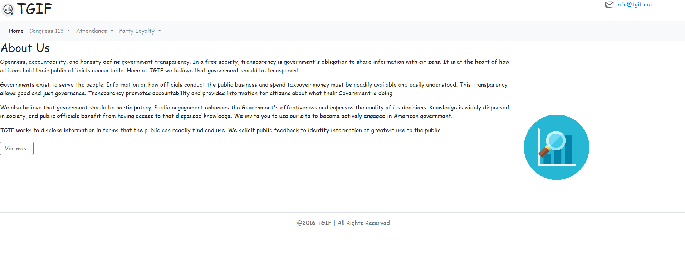
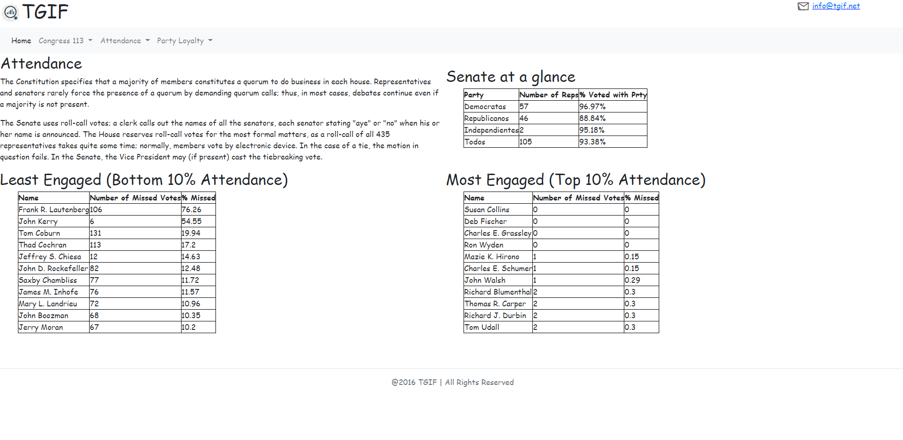

# TGIF Page

Esto es un pagina que hice como parte de mi educación en [MindHub](https://mindhubweb.com/), que consistió en crear una pagina en la que consumia datos en formato JSON de 2 archivos y hacia calculos sobre ellos para luego mostrarlos.

  

## Tecnologías usadas

- Front End:
    + HTML
    + CSS - Bootsrap
    + Javascript

- Deploy:
    + Firebase

# Como iniciar el proyecto

 - Clonar el repositorio en su computadora
 - Ejecutar el archivo `index.html` en la carpeta `public`
 - También puedes probarla [Aquí](https://tgif-page.web.app/)
 
 # Vista previa

### Pagina Home

  

### Una de las paginas de estadisticas

  

